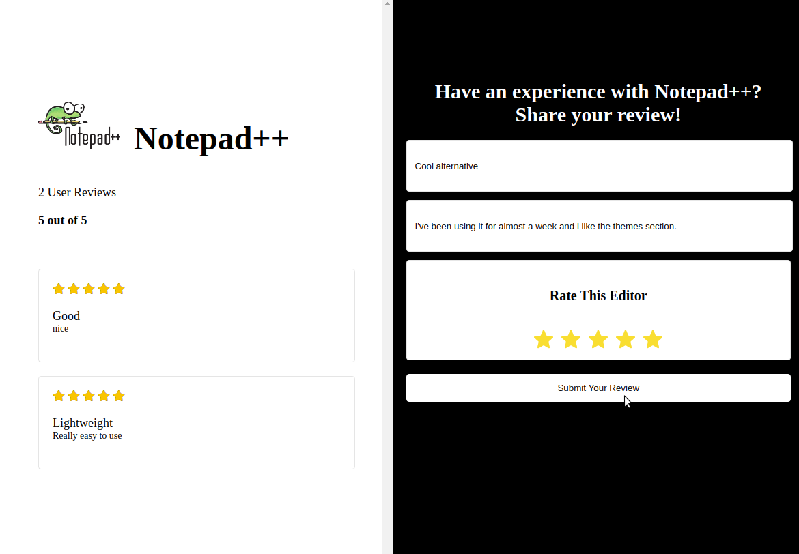

## Product Review App

This project was built using Ruby on Rails and React.js using Webpacker.
It consists of a basic CRUD application implementing a RESTFul API with Ruby on Rails, 
which allows users to add new reviews with a rating(1-5) for a specific product.

## Built With
- Ruby on Rails 6 (Backend)
- ReactJS (Frontend)
- Webpacker (Bundler)
- Redux Hooks API
- React Router (Route Handling)
- fast_jsonapi (Ruby Serializer)
- styled-components (CSS Styling)

## App Screenshots




## Setup instructions

Open a terminal window, go to the location you'd like to add the project and then run the commands below.

### Clone Repository

```console
git clone https://github.com/noomdalv/rails-react_reviewer.git
```

### Setup

In your terminal, go to the api directory within the created rails-react_reviewer folder and install dependencies with:
```console
bundle exec rails db:prepare
```
and start the server with:
```console
bundle exec rails s
```

## Special Thanks to [@zayneio](https://github.com/zayneio/open-flights) for his amazing guide.

## Author

👤 **Vladimir Luna**

- Github: [@noomdalv](https://github.com/noomdalv)


## 📝 License

This project is [MIT](lic.url) licensed.
